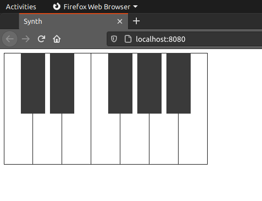

# Synthesizer


WIP

- Master gain control (`0.00x`-`2.00x`)
- Main oscillator (`sine`, `square`, `sawtooth`, `triangle`)
- Unison control (`1`-`8`)
- Detune control (`0.0hz`-`10.0hz`)
- Noise oscillator
- Amplifier
  - Attack control (`0.00s`-`1.00s`)
  - Decay control (`0.00s`-`1.00s`)
  - Sustain control (`0.00x`-`1.00x`)
  - Release control (`0.00s`-`1.00s`)
- Virtual keyboard (`C3`-`B3`)
- Controllable via MIDI keyboards



## Install dependencies

```bash
yarn
```

## Build

```bash
yarn build
```

## Generate `.d.ts` files

```bash
yarn gen-dts
```

## Launch devServer

```bash
yarn dev
```

## Lint

```bash
yarn lint
```

## Format

```bash
yarn format
```

## Launch Storybook

```bash
yarn storybook
```
