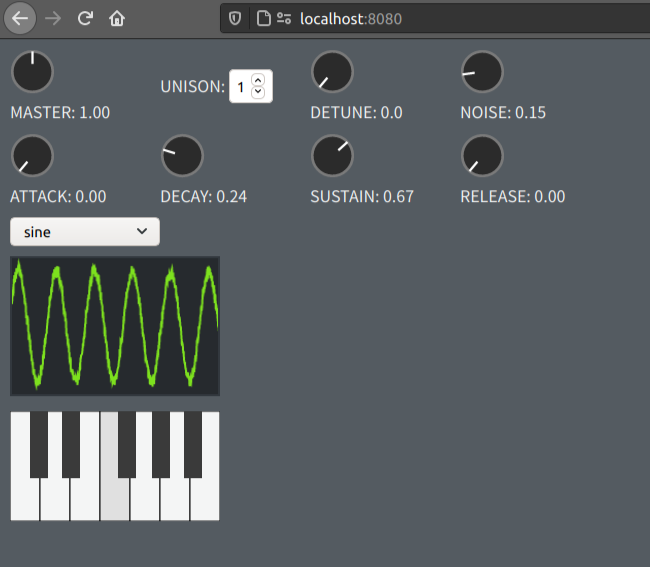

# Synthesizer

WIP



## Install dependencies

```
$ yarn
```

## Build

```
$ yarn build
```

## Generate `.d.ts` files

```
$ yarn gen-dts
```

## Launch devServer

```
$ yarn dev
```

## Lint

```
$ yarn lint
```

## Format

```
$ yarn format
```
